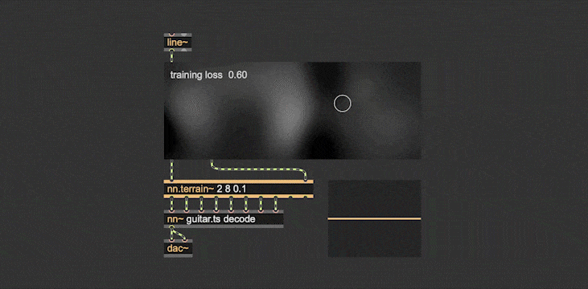
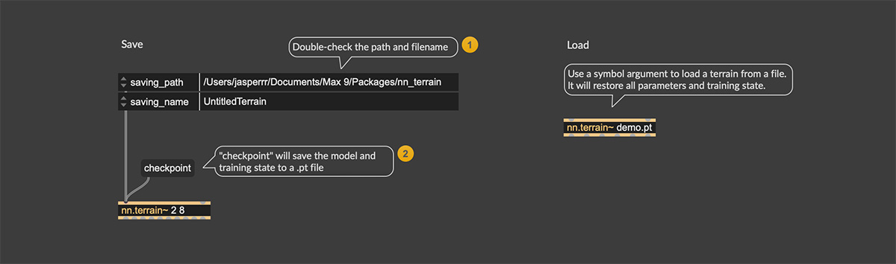
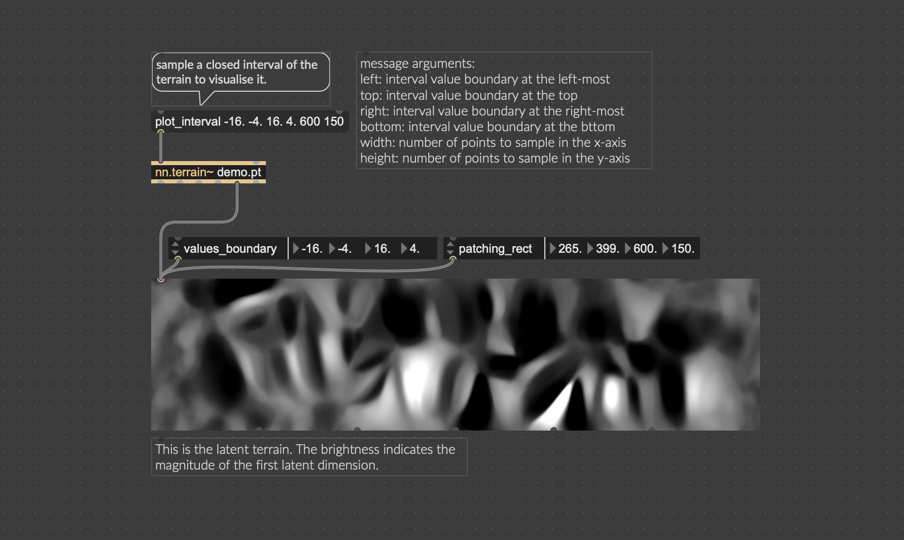
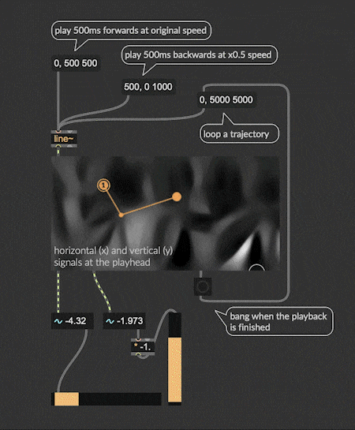

# Latent Terrain: Coordinates-to-Latents Generator for Neural Audio Autoencoders

> New documentation page: [https://jasper-zheng.github.io/nn_terrain/](https://jasper-zheng.github.io/nn_terrain/)

</img>

Latent terrain is a coordinates-to-latents mapping model for neural audio autoencoders (such as [RAVE](https://github.com/acids-ircam/RAVE), [Music2Latent](https://github.com/SonyCSLParis/music2latent)). A terrain is a surface map for the autoencoder's latent space, taking coordinates in a control space as inputs, and producing continuous latent vectors in real-time.

Latent terrain aims to open up the creative possibilities of **latent space navigation**, allowing one to adapt an autoencoder to easier-to-navigate interfaces (such as gestural controllers, stylus and tablets, XY-pads, and more), and build new musical instruments that compose and interact with AI audio generators.

An example latent space walk with Music2Latent:

https://github.com/user-attachments/assets/4fbac683-968f-446e-9e41-905f8eb3de49

All documentation, installation and building instruction, please see our new web documents: [https://jasper-zheng.github.io/nn_terrain/](https://jasper-zheng.github.io/nn_terrain/)
<!-- 
#### Saving (Checkpoints)

 - Use the `checkpoint` message to save the tarrain to a `.pt` file. Saving name and path can be set in attributes.
 - Load a terrain `.pt` file by giving its file name as an argument.

### Visualising a terrain 

Since the control space is 2D, the latent space can be visualised by sampling the control space across a closed interval (i.e., width and height in this example). Use the `plot_interval` message to do this:  
 - `plot_interval` for 2D plane takes 6 arguments:
 - lower and upper bound values of the x and y axes in the control space (these usually are the same as the `values_bound` attribute of `nn.terrain.gui`)
 - resolution of the x and y axes (these usually are the same as the width and height of `nn.terrain.gui`)

### Programming trajectory playback  

You can create trajectories to navigate the terrain. This trajectory playback can be controled be a signal input. 
 - Set the 'UI Tasks' (`task`) attribute of nn.terrain.gui to 'play'.
 - This behaviour is similar to the `play~` object in Max.
 - </img>

### Stylus mode  

Set the 'UI Tasks' (`task`) attribute of nn.terrain.gui to 'stylus' to use it as a trackpad. If you are using a tablet/stylus, it also supports the pen pressure.

https://github.com/user-attachments/assets/2dd7edea-583d-410b-8b09-7aa1eec09bfa

### Point-by-Point Steering  

[todo] It also supports the [point-by-point steering approach](https://vigliensoni.com/portfolio/42-vigliensoni23steering/) proposed by Vigliensoni and Fiebrink (2023). -->

## Change Logs

**Oct. 2025** v1.5.6.1 and v1.6.0.1

 - `nn.terrain~`:  
   - Terrain training moved to multi-thread, `train` and `plot_interval` message won't block the main thread anymore.  
   - The last argument in `plot_interval` now defines which latent dimension to sample, a new attribute `plot_multi_channel` is added for coloured plot.
 - `nn.terrain.encode`: 
   - Supported autoencoders with stereo io channels (i.e., supoorted `stable-audio-open-1.0`); 
   - Default `encoder_batch_size` chenged from 64 to 16; 
   - Fixed the faulty argument list.  
 - Cleaned up the codebase: Fourier-CPPN, Dataset classes moved to `backend.cpp`.

**Aug. 2025** v1.5.6 and v1.6.0

 - [BREAKING CHANGE] Changed order of arguments for the `plot_interval` method in `nn.terrain~`, to be align with the `value_boundaries` attribute in `nn.terrain.gui`.
 - [BREAKING CHANGE] All attribute names updated.
 - Mouse behaviours in `nn.terrain.gui` updated: the output coordinates dictionary will be automatically updated whenever a "mouse up" is performed.
 - Fixed the playhead updates in the `play` mode in `nn.terrain.gui`.
 - [HELP FILES] Added a JS script for patch cords scripting.

**May. 2025** v1.5.6-beta and v1.6.0-beta

 - The first release.

## Build Instructions

Please refer to [https://jasper-zheng.github.io/nn_terrain/compile/](https://jasper-zheng.github.io/nn_terrain/compile/).
 
## TODOs   

- [✕︎] Load and inference scripted mapping model exported bt torchscript.   
- [✔︎] Display terrain visualisation.  
  - [✔︎] Greyscale (one-channel)   
  - [✔︎] Multi-channel (yes but no documentation atm)   
- [✔︎] Interactive training of terrain models in Max MSP.   
- [✔︎] Customised configuration of Fourier-CPPNs (Tancik et al., 2020).  
- [✔︎] Example patches, tutorials...  
- [✕︎] PureData

<!-- ## Build Instructions  

If the externals have trouble opening in Max, or doesn't work correctly with nn_tilde, you might want to build the externals yourself, see the [Build Instructions](BuildInstructions.md) documentation. -->

## Get in touch

Hi, this is Shuoyang (Jasper). `nn.terrain~` is part of my ongoing PhD work on **Discovering Musical Affordances in Neural Audio Synthesis**, supervised by Anna Xambó Sedó and Nick Bryan-Kinns, and part of the work has been (will be) on putting AI audio generators into the hands of composers/musicians.

Therefore, I would love to have you involved in it - if you have any feedback, a features request, a demo / a device / or anything made with nn.terrain, I would love to hear. If you would like to collaborate on anything, please leave a message in this [feedback form](https://forms.office.com/e/EJ4WHfru1A).  

## Acknowledgements

 - Shuoyang Zheng, the author of this work, is supported by UK Research and Innovation [EP/S022694/1].

 - This is built on top of acids-ircam's [nn_tilde](https://github.com/acids-ircam/nn_tilde), with a lot of reused code including the cmakelists templates, `backend.cpp`, `circular_buffer.h`, and the model performing loop in `nn.terrain_tilde.cpp`.  
 - Caillon, A., Esling, P., 2022. Streamable Neural Audio Synthesis With Non-Causal Convolutions. https://doi.org/10.48550/arXiv.2204.07064  
 - Tancik, M., Srinivasan, P.P., Mildenhall, B., Fridovich-Keil, S., Raghavan, N., Singhal, U., Ramamoorthi, R., Barron, J.T., Ng, R., 2020. Fourier Features Let Networks Learn High Frequency Functions in Low Dimensional Domains. NeurIPS.  
 - Vigliensoni, G., Fiebrink, R., 2023. Steering latent audio models through interactive machine learning, in: In Proceedings of the 14th International Conference on Computational Creativity.  

