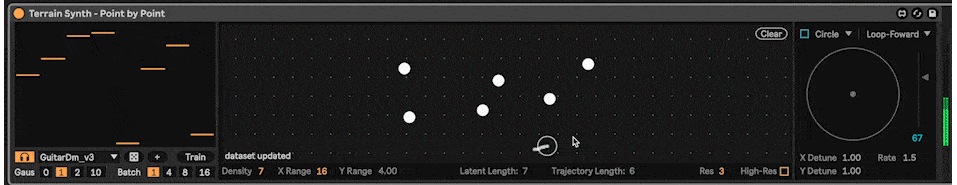

# Latent Terrain Priors for Neural Audio Autoencoders

Constructing a terrain by defining the trajectories of audio fragments:  
   

It also supports the point-by-point steering approach proposed by Vigliensoni and Fiebrink (2023):    
   

*Latent Terrain* is an algorithmic approach to dissecting the latent space of a neural audio autoencoder (e.g., [RAVE](https://github.com/acids-ircam/RAVE)) into a lower-dimensional (e.g., 2D), mountainous, and steep space. The dissected structure is a streamable "terrain", which can be used to access latent vectors given coordinates in the lower-dimensional space.

This is a (work-in-progress) Max external for sound synthesising with latent terrain, as well as creating letent terrains on-the-fly, using interactive machine learning.  

The external, demo Max patches, documentation and tutorials will be released soon.

## Demos

Demo videos recorded for the IRCAM Forum Workshops 2025, see the [article](https://forum.ircam.fr/article/detail/latent-terrain-dissecting-the-latent-space-of-neural-audio-autoencoder-by-shuoyang-jasper-zheng/).  


https://github.com/user-attachments/assets/39dc648f-7c11-4669-895a-1f46999ddca1


## Progress   

We're currently testing the model on acids-ircam's [nn_tilde](https://github.com/acids-ircam/nn_tilde).  

- [✔︎] Load and inference scripted mapping model exported bt torchscript.   
- [✕︎] Display terrain visualisation.  
  - [✔︎] Greyscale (one-channel)  
  - [✕︎] Multi-channel  
- [✔︎] Interactive training of terrain models in Max MSP.   
- [✕︎] Customised configuration of Fourier-CPPNs (Tancik et al., 2020).  
- [✕︎] Documentation, example patches, tutorials...  

## Compile

<s>To compile, you will need: </s>  
<s> - Min-DevKit, available from the Package Manager inside of Max or [directly from Github](https://github.com/Cycling74/min-devkit).   </s>  
<s> - [LibTorch](https://pytorch.org/cppdocs/installing.html).  </s>

```
cmake -G Xcode ../src/ -DCMAKE_PREFIX_PATH=/path/to/libtorch -DCMAKE_BUILD_TYPE=Release
```

At the final stage of cleaning up the repository, planning to get everything done by mid-May.  
Once ready, a release tag will be added to the repository, with the external objects, example Max patches, instructions to compile.

## Acknowledgements

 - This work is supported by UK Research and Innovation [EP/S022694/1].

 - This is built on top of acids-ircam's [nn_tilde](https://github.com/acids-ircam/nn_tilde).  
 - Caillon, A., Esling, P., 2022. Streamable Neural Audio Synthesis With Non-Causal Convolutions. https://doi.org/10.48550/arXiv.2204.07064  
 - Tancik, M., Srinivasan, P.P., Mildenhall, B., Fridovich-Keil, S., Raghavan, N., Singhal, U., Ramamoorthi, R., Barron, J.T., Ng, R., 2020. Fourier Features Let Networks Learn High Frequency Functions in Low Dimensional Domains. NeurIPS.  
 - Vigliensoni, G., Fiebrink, R., 2023. Steering latent audio models through interactive machine learning, in: In Proceedings of the 14th International Conference on Computational Creativity.  

