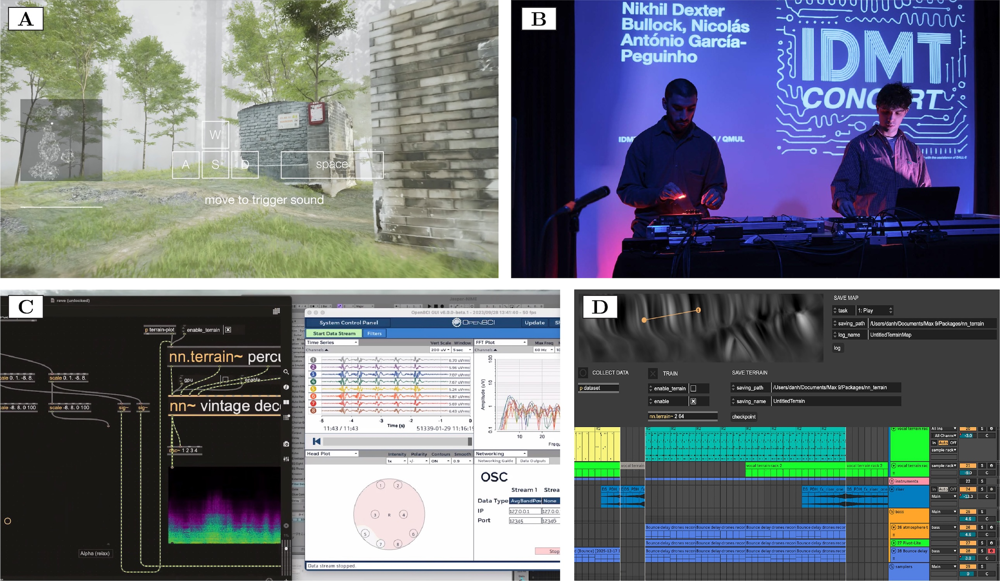

<figure>
    
    <figcaption>
        Portfolio with latent terrain
    </figcaption>
</figure>

We worked with several artist-researchers to explore NIME design with autoencoders and latent terrain. This resulted in an **Annotated Portfolio** that brings together a collection of design artefacts into a systematic body of work, to explain the thinking behind them, and show not just the uniqueness of each work, but also the broader design issues the collection addresses. To quote from [Gaver and Bowers (2012)](https://doi.org/10.1145/2212877.2212889), "\[annotations\] point to features of our designs and connect them to matters of further concern, in the case of research, making them topical for discussion within a given community".

<!-- ## Project 1: nn/mémoire
by *Jiatong Liu*

## Project 2: Repressive Latent Terrain
by *Keigo Yoshida*

{{ 'https://www.youtube-nocookie.com/embed/A0bdwQGtKqQ?si=eRUN7HJjXjyyLjEs?controls=1' | embed }}

 

"Repressive Latent Terrain" is a sonification that embarks on a real-time exploration of the hidden latent space within the neural network model RAVE. The entire journey is dynamically driven by the subject's Electroencephalography (EEG) data, ensuring the network's generative output is continuously reshaped by the subject's cognitive state.

The work is structured as a closed-loop, biofeedback system designed for intense human-machine interaction. The participant initiates the experiment by wearing an OpenBCI Ultracortex EEG device and entering focused meditation. They are simultaneously immersed in the continuous, evolving soundscape derived from the outputs of nn.terrain and an nn~ decoder. This mechanism establishes a feedback connection, in which the subject's brainwave frequencies are translated into sonic changes, thereby creating a loop between the machine's generative process and the intimate human cognitive experience.

The core artistic theme revolves around the active manipulation of consciousness. The piece deliberately targets the dynamic balance between two critical brainwave frequencies. Alpha waves, the hallmark of deep relaxation and inner calm, and Gamma waves, associated with high-level arousal and active processing. -->

