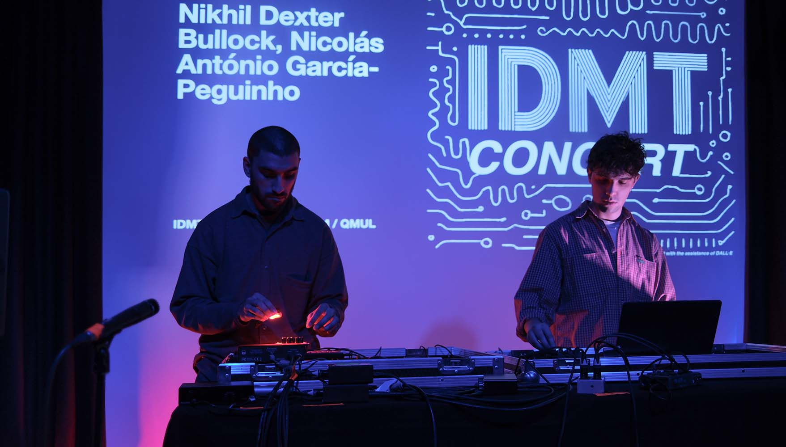

Interview with Nico García-Peguinho, edited by Jasper Shuoyang Zheng.



<!-- {{ 'https://www.youtube-nocookie.com/embed/A0bdwQGtKqQ?si=eRUN7HJjXjyyLjEs?controls=1' | embed }} -->

  

{% iconCard 'Artist Bio', '**Nico García-Peguinho** is an artist and researcher investigating machine listening and algorithmic composition. His work has been exhibited and performed at venues including Creative Coding Utrecht (live-coding AV performance), Manchester Histories Festival Opening Ceremony (8-channel installation), and MANTIS festival (multichannel fixed compositions). He is a first-year PhD student at the Centre for Digital Music (C4DM), Queen Mary University of London, and a member of the Sensing the Forest project.', 'user' %} 

 

##### Before starting the nn.terrain project, did you have any hands-on experience with neural audio synthesis (e.g., RAVE)?

**Nico:** Yes, I used RAVE about two years ago to extend electroacoustic material. I’d feed audio in and generate lots of timbral variations, then process them further with granular techniques. It wasn’t the easiest tool to use, and after one composition, I felt I’d gotten what I needed and didn’t explore it further.

##### How did you approach working with nn.terrain?
**Nico:** I started by experimenting a lot, trying different pre-trained models and exploring the 2D space, navigating that space and seeing what gestures and movements I liked. Eventually I preferred a looping approach, interpolating between points on the plane. Seeking help from the community helped me learn things like using the pixel dictionary, which made the system easier to visualize. 

**Nico:** Listening to what output sounds like was quite important in my workflow. If it doesn't sound good, it doesn't sound good. And if it does, it does. So active listening is quite important.

##### Is working with neural audio synthesis different from working with other materials (e.g., conventional sound synthesis algorithms / samples)?
**Nico:** Definitely. Sample-based synthesis feels more controllable because you can see waveforms and there are lots of visualization tools. Oscillator-based synthesis also offers strong control through DSP. Then when it comes to neural audio, it feels less intuitive, maybe because it’s new and people are still exploring how to best exploit it. Very often you have to build things yourself, which makes it harder to work with.

##### What did you learn about neural audio synthesis, through the making/crafting process of your project? What has changed compared to the attempt two years ago?
**Nico:** I would say that's a massive amount. It's the first time that I've had a deep dive into autoencoders. Especially on how latent spaces can be decoded into audio, that always felt mysterious to me before. Yes, it changed my workflow with RAVE, I was just pumping values in and seeing what material I could get, quite primitive. But for RAVE plus nn.terrain, it provides an easy way of navigating the sound space and controlling it, which certainly makes it a more compelling tool to integrate into my music composition.

**Nico:** Being able to control that space and to generate material directly from that space, as opposed to generating some sound material to then use down the line, are quite different paradigms of working.

##### What would you like to see implemented in the tool in the future?
**Nico:** Making an Ableton plugin would be great, it would make the tool more accessible to non-Max users, those with less expertise in audio programming, and reach a bigger community. I’d also love to see DSP features integrated, so it feels more like a sound synthesis tool. Another idea is storing points and moving between them, like triggering sounds on a drum pad.
