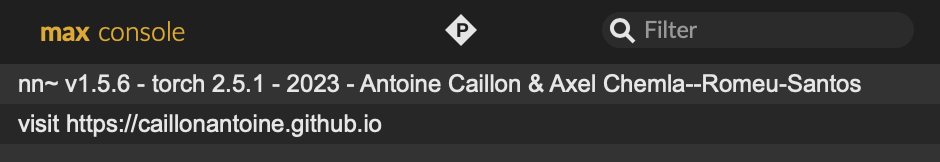

This repository is a set of MaxMSP/Max4Live externals to build, visualise, and program latent terrain:

<table>
<thead>
<tr>
<th>Object</th>
<th>Description</th>
</tr>
</thead>
<tbody>

<tr><td><code>nn.terrain~</code></td>
<td> 

 - Load, build, train, and save a terrain.  
 - Perform the coordinates-to-latents mapping. 
 </td>
</tr>

<tr><td><code>nn.terrain.encode</code></td>
<td>

 - Using a pre-trained autoencoder to encode audio buffers into **latent trajectories**, as training data for `nn.terrain~`.
</td>
</tr>

<tr><td><code>nn.terrain.record</code></td>
<td>

 - Manually recording **latent trajectories**, as training data for `nn.terrain~`.  
</td>
</tr>

<tr><td><code>nn.terrain.gui</code></td>
<td>

 - Edit **spatial trajectories**, as training data for `nn.terrain~`. 
 - Visualise the terrain.
 - Create and program trajectory playbacks.
</td>
</tr>

</tbody>
</table>

All externals above are designed to work together with `nn~`, which is a MaxMSP/Max4Live external developed by acids-ircam to load and use deep learning realtime audio processing models:

<table>
<thead>
<tr>
<th>Object</th>
<th>Description</th>
</tr>
</thead>
<tbody>

<tr><td><code>nn~</code></td>
<td> 

 - Hosting the decoder of an AI audio autoencoder, to decode latents to audio in realtime.

 </td>
</tr>

</tbody>
</table>

## Download

Depending on which version of `nn~` you're using:  

* If you're using [nn~ v1.5.6 (torch v2.0.0/2.0.1)](https://github.com/acids-ircam/nn_tilde/releases/tag/v1.5.6) (the 2023 version):  Please download [nn.terrain~ v1.5.6](https://github.com/jasper-zheng/nn_terrain/releases/tag/v1.5.6).  
* If you're using [nn~ v1.6.0 (torch v2.5.0/2.5.1)](https://github.com/acids-ircam/nn_tilde/releases/tag/v1.5.6) (the 2025 version):  Please download [nn.terrain~ v1.6.0](https://github.com/jasper-zheng/nn_terrain_tilde/releases/tag/1.6.0-macos).  

While the 1.6.0 `nn~` offers amazing add-on functionalities, I personally use the 1.5.6 version more often because it does exactly what I need already, and it's more stable with `nn.terrain~`.

If you're unsure which version you're using, this can be checked from your Max console when an `nn~` instance is first opened in Max:  

</img>  

If you have a customised `nn~` like me, you might need to consider compiling your own `nn.terrain~` from source, please see instructions [Compile from Source](/compile).

## Installation

`nn.terrain~` needs to be installed in different ways, depending on which version of `nn~` you're using:

### With nn~ v1.5.6
* **macOS**
  * Uncompress the `.tar.gz` file into the `Package` folder of your Max documents, which is usually in `~/Documents/Max 9/Packages`.
  * Reopen Max and you can find all `nn.terrain` objects.
  * You might get a quarantine warning, proceed will disable this warning. 
* **Windows**
  * Uncompress the `.tar.gz` file into the `Package` folder of your Max documents, which is usually in `~/Documents/Max 9/Packages/`
  * Copy all `.dll` files in the package next to the `Max.exe` executable (if you have already done this for `nn~`, you don't need to do this again).

### With nn~ v1.6.0
* **macOS**
  * Uncompress the `.tar.gz` file
  * In `~/Documents/Max 9/Packages`, **copy and merge** the unzipped folders to the `nn_tilde` folder, make sure that all externals (e.g., `nn.terrain~.mxo`) are placed next to `nn~.mxo` in the same folder.
  * Reopen Max and you can find all `nn.terrain` objects.
  * You might get a quarantine warning, proceed will disable this warning. 
* **Windows**
  * To be updated soon.

If the externals have trouble opening in Max, or doesn't work correctly with `nn~` you might considering compiling the externals yourself, see [Compile from Source](/compile).  
