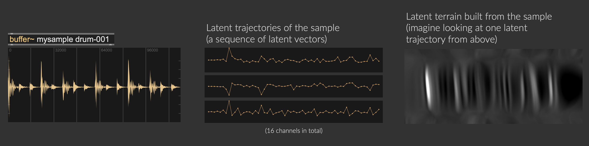

A neural audio autoencoder (such as [RAVE](https://github.com/acids-ircam/RAVE)) is an AI audio generation tool, it has two components: an encoder and a decoder.    
* The `encoder` compresses a piece of audio signal into a sequence of latent vectors (a **latent trajectory**). This compression happens in the time domain, so that the sampling rate goes from 44100Hz (audio sampling rate) to 21.5Hz (latent space sampling rate).
* The `decoder` takes the latent trajectory to produce a piece of audio signal. The decoder can also be used as a parametric synthesiser by navigating the latent space (i.e., **latent space walk**).  
* A **latent terrain** is a surface map created from the latent trajectory, just like looking at a latent trajectory from above.

<figure class="wide">
    
    <figcaption>
        Audio sample, latent trajectory, and latent terrain.
    </figcaption>
</figure>

It allows you to navigate latent space of the generative AI like walking on a terrain surface, tailoring the latent space to a low-dimensional (e.g., a 2D plane) control space. 

And this terrain surface is **nonlinear** (i.e., able to produce complex sequential patterns), **continuous** (i.e., allows for smooth interpolations), and **tailorable** (i.e., DIY your own materials with interactive machine learning).

An example **latent space walk** with Music2Latent:

<video controls="" loop="" playsinline="" aria-labelledby="video-label" src="../../assets/terrain-walk.mp4" width="95%"></video>
