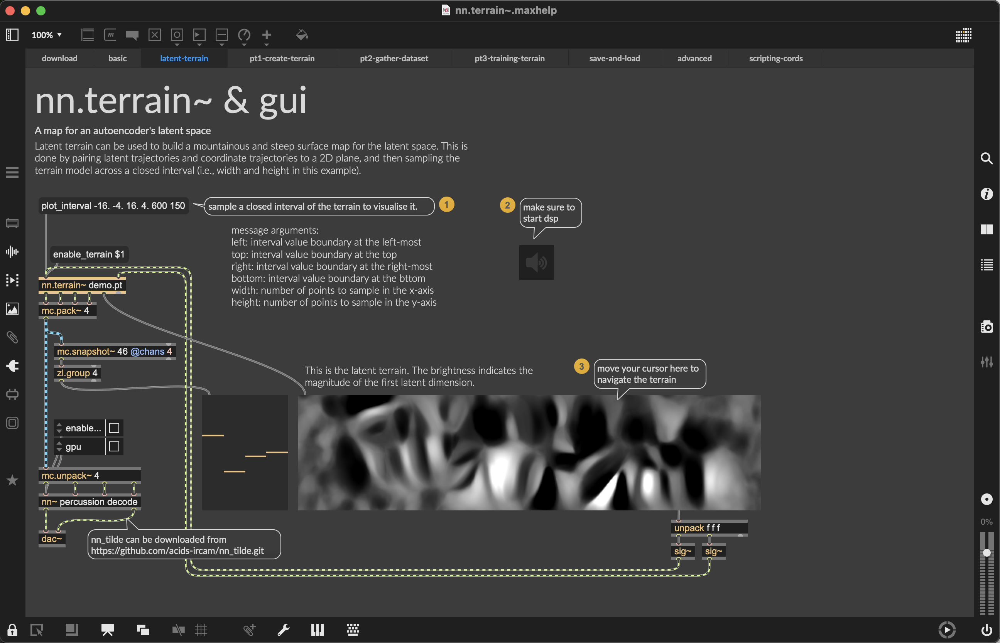

This video introduces loading a terrain with 2 continuous control channels, navigating an autoencoder with 4 latent dimensions.

## What we need

* Make sure to have `nn.terrain` package and `nn~` installed correctly, see [Download and Installation](/installation) for this.
* Make sure to grab an **autoencoder** (a `.ts` file) and a **terrain** model (a `.pt` file) from [Pre-Trained Terrains (Presets)](/pre-trained).

## Synopsis  

<figure class="wide">
    
    <figcaption>
        Example can be found in the help file of `nn.terrain`.
    </figcaption>
</figure>

This tutorial guides you through: 

* A brief introduction of an autoencoder and latent terrain,
* Loading a pre-trained terrain in MaxMSP,
* Adding an XY pad to control the navigation in the terrain,
* Visualising latent vectors (via multisliders),
* Visualising the terrain (rendering a surface map).

Video: 
{{ 'https://www.youtube-nocookie.com/embed/l97QXTctZuU?controls=1' | embed }}

