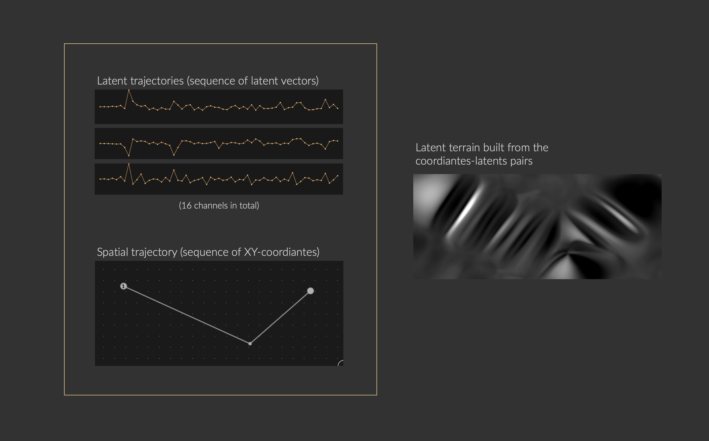

## What we need

To built a terrain from scratch, we need pairs of **latent trajectories** and **spatial trajectories**.  

* **Latent trajectories** are sequences of latent vectors encoded from audio buffers.
* **Spatial trajectories** are sequences of coordiantes in a control space. For instance:
  * Trajectory of mouse in an XY track pad
  * Trajectory of hand gestures in an XYZ 3D space
  * Timestamps in a timeline playback system

A terrain is a **supervised machine learning** model that learns this coordiantes-to-latents pairs, so that it can produce new latent vectors given any coordiantes in the control space. 

<figure>
    
    <figcaption>
        Latent trajectories, spatial trajectories, and latent terrain.
    </figcaption>
</figure>