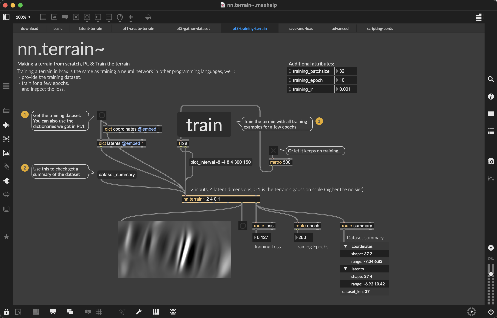

An object `nn.terrain~ 2 4` creates an **empty** terrain with 2 control channels and 4 latent channels. The video tutorial introduces creating training dataset for building `nn.terrain~ 2 4`.

## What we need

To build a terrain from scratch, we need a training dataset: pairs of **latent trajectories** and **spatial trajectories**.  

* **Latent trajectories** are sequences of latent vectors encoded from audio buffers.
* **Spatial trajectories** are sequences of coordiantes in a control space. For instance:
  * Trajectory of mouse in an XY track pad
  * Trajectory of hand gestures in an XYZ 3D space
  * Timestamps in a timeline playback system

A terrain is a **supervised machine learning** model that learns this coordiantes-to-latents pairs, to produce new latent vectors given any coordiantes in the control space, so that the control space can be rendered as a "map" for the latent space.

<figure>
    
    <figcaption>
        Latent trajectories, spatial trajectories, and latent terrain.
    </figcaption>
</figure>

## Synopsis  

<figure class="wide">
    
    <figcaption>
        Example can be found in the help file of `nn.terrain`.
    </figcaption>
</figure>

This tutorial guides you through: 

* Creating an empty terrain with customised number of inputs, outputs.  
* Gathering **latent trajectories** from audio buffers, using `nn.terrain.encode`.
* Plotting 2D **spatial trajectories** in `nn.terrain.gui` with customised length.
* Training the empty terrain with latent and spatial trajectories.
  * Setting up training dataset
  * Monitoring the training loss
  * Visualising terrain on-the-fly
  * Saving checkpoints

Video: 
{{ 'https://www.youtube-nocookie.com/embed/pAWJsSA4ZKQ?controls=1' | embed }}

