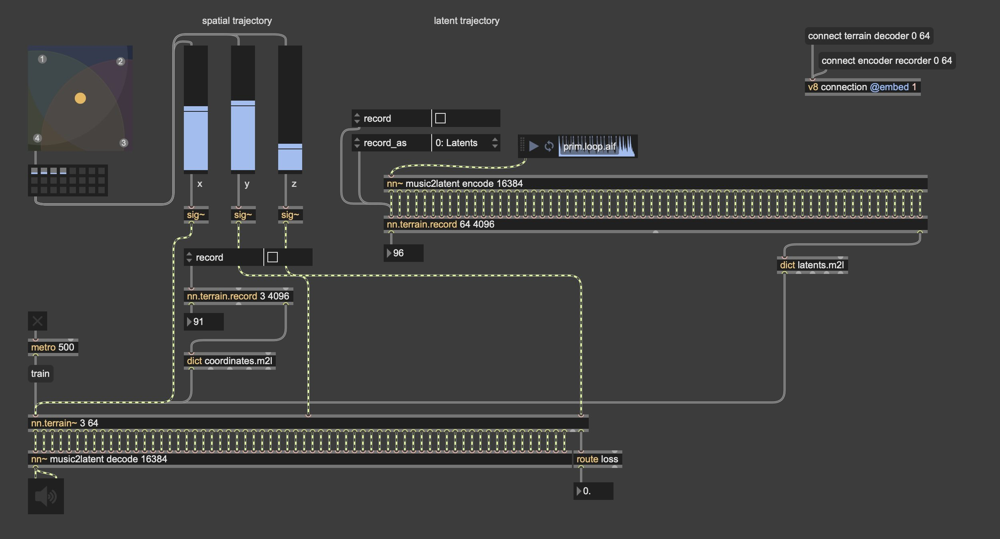

The `nn.terrain.record` object is a recorder that record multichannel signal as dictionary dataset. The recorded dictionary can be used to [build a latent terrain](../build-terrain).

The video tutorial covers building a terrain in a 3D control space, for an autoencoder ([music2latent](https://github.com/jasper-zheng/music2latent-scripted.git)). The exported `music2latent.ts` can be found

## Synopsis  

<figure class="wide">
    
    <figcaption>
        Example can be found in the help file of `nn.terrain.record`.
    </figcaption>
</figure>

This tutorial guides you through: 

* Creating an empty terrain with 3 inputs, 64 outputs,
* Scripting patch cords (i.e., adding all cords in one click),
* Recording latent trajectory with an encoder, from an audio buffer,
* Recording spatial trajectory from three sliders,
* Training the terrain.

Video: 
{{ 'https://www.youtube-nocookie.com/embed/iLdffSffsR8?controls=1' | embed }}

