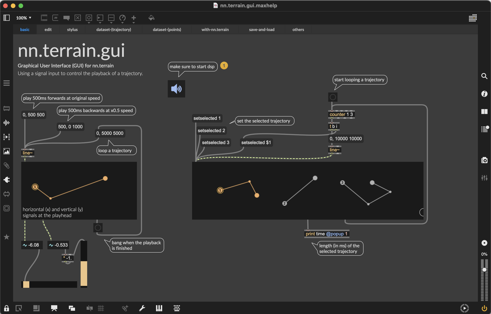

The `play` mode of `nn.terrain.gui` offers position-based trajectory playback, which is similar to the `play~` object in Max - plays back latent trajectories based on an offset within the trajectory.  

It can be used with any signal that generates a positional value in milliseconds (e.g., the `line~` object).

</img>

**Please see the help file of `nn.terrain.gui` in Max for details:**

</img>